# emoji

Emoji created by hakatashi

## License

[Creative Commons Zero v1.0 Universal](LICENSE)

## Emojis

`:akan:` | `:black:` | `:chaunen:` | `:damejan:`
:-: | :-: | :-: | :-:
[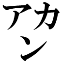](https://github.com/hakatashi/emoji/raw/master/images/akan.png) | [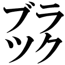](https://github.com/hakatashi/emoji/raw/master/images/black.png) | [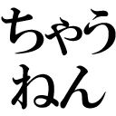](https://github.com/hakatashi/emoji/raw/master/images/chaunen.png) | [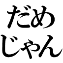](https://github.com/hakatashi/emoji/raw/master/images/damejan.png)

`:gouhou:` | `:ihou:` | `:isshu:` | `:ryoukai:`
:-: | :-: | :-: | :-:
[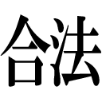](https://github.com/hakatashi/emoji/raw/master/images/gouhou.png) | [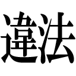](https://github.com/hakatashi/emoji/raw/master/images/ihou.png) | [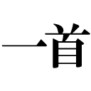](https://github.com/hakatashi/emoji/raw/master/images/isshu.png) | [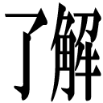](https://github.com/hakatashi/emoji/raw/master/images/ryoukai.png)

`:kowai:` | `:maa:` | `:medetai:` | `:nandane:`
:-: | :-: | :-: | :-:
[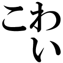](https://github.com/hakatashi/emoji/raw/master/images/kowai.png) | [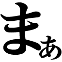](https://github.com/hakatashi/emoji/raw/master/images/maa.png) | [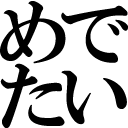](https://github.com/hakatashi/emoji/raw/master/images/medetai.png) | [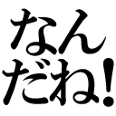](https://github.com/hakatashi/emoji/raw/master/images/nandane.png)

`:saikou:` | `:seyaroka:` | `:shumi:` | `:sonnani:`
:-: | :-: | :-: | :-:
[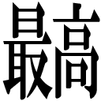](https://github.com/hakatashi/emoji/raw/master/images/saikou.png) | [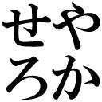](https://github.com/hakatashi/emoji/raw/master/images/seyaroka.png) | [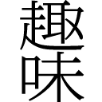](https://github.com/hakatashi/emoji/raw/master/images/shumi.png) | [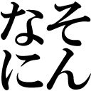](https://github.com/hakatashi/emoji/raw/master/images/sonnani.png)

`:sorasouyo:` | `:sorehasou:` | `:sorehauso:` | `:hototogisu:`
:-: | :-: | :-: | :-:
[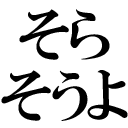](https://github.com/hakatashi/emoji/raw/master/images/sorasouyo.png) | [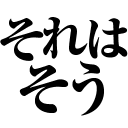](https://github.com/hakatashi/emoji/raw/master/images/sorehasou.png) | [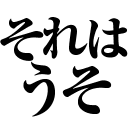](https://github.com/hakatashi/emoji/raw/master/images/sorehauso.png) | [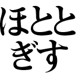](https://github.com/hakatashi/emoji/raw/master/images/hototogisu.png)

`:sirankedo:` | `:sirangana:`
:-: | :-:
[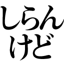](https://github.com/hakatashi/emoji/raw/master/images/sirankedo.png) | [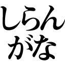](https://github.com/hakatashi/emoji/raw/master/images/sirangana.png)

`:yakuza:` | `:yatta-:` | `:yurusan:` | `:yusho:`
:-: | :-: | :-: | :-:
[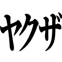](https://github.com/hakatashi/emoji/raw/master/images/yakuza.png) | [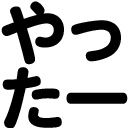](https://github.com/hakatashi/emoji/raw/master/images/yatta-.png) | [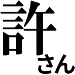](https://github.com/hakatashi/emoji/raw/master/images/yurusan.png) | [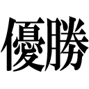](https://github.com/hakatashi/emoji/raw/master/images/yusho.png)

`:shoki-ka:` | `:ee:` | `:guchol:` | `:ho-:`
:-: | :-: | :-: | :-:
[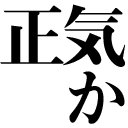](https://github.com/hakatashi/emoji/raw/master/images/shoki-ka.png) | [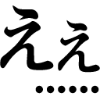](https://github.com/hakatashi/emoji/raw/master/images/ee.png) | [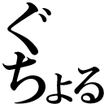](https://github.com/hakatashi/emoji/raw/master/images/guchol.png) | [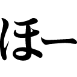](https://github.com/hakatashi/emoji/raw/master/images/ho-.png)

`:kowa:` | `:ikku:` | `:noushi:`
:-: | :-: | :-:
[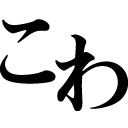](https://github.com/hakatashi/emoji/raw/master/images/kowa.png) | [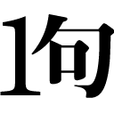](https://github.com/hakatashi/emoji/raw/master/images/ikku.png) | [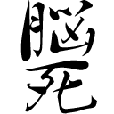](https://github.com/hakatashi/emoji/raw/master/images/noushi.png)

`:otsu:` | `:kami:` | `:moe:` | `:ha:`
:-: | :-: | :-: | :-:
[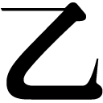](https://github.com/hakatashi/emoji/raw/master/images/otsu.png) | [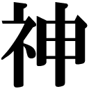](https://github.com/hakatashi/emoji/raw/master/images/kami.png) | [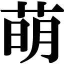](https://github.com/hakatashi/emoji/raw/master/images/moe.png) | [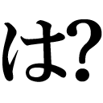](https://github.com/hakatashi/emoji/raw/master/images/ha.png)

`:yami:` | `:ya:`
:-: | :-:
[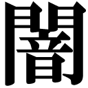](https://github.com/hakatashi/emoji/raw/master/images/yami.png) | [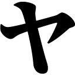](https://github.com/hakatashi/emoji/raw/master/images/ya.png)

`:jimei:` | `:hijimei:` | `:hayakunero:` | `:hoge:`
:-: | :-: | :-: | :-:
[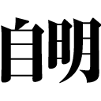](https://github.com/hakatashi/emoji/raw/master/images/jimei.png) | [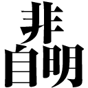](https://github.com/hakatashi/emoji/raw/master/images/hijimei.png) | [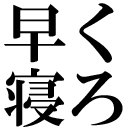](https://github.com/hakatashi/emoji/raw/master/images/hayakunero.png) | [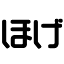](https://github.com/hakatashi/emoji/raw/master/images/hoge.png)

`:kachi:` | `:korosuzo:` | `:naguru:` | `:nya-n:`
:-: | :-: | :-: | :-:
[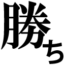](https://github.com/hakatashi/emoji/raw/master/images/kachi.png) | [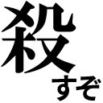](https://github.com/hakatashi/emoji/raw/master/images/korosuzo.png) | [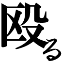](https://github.com/hakatashi/emoji/raw/master/images/naguru.png) | [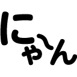](https://github.com/hakatashi/emoji/raw/master/images/nya-n.png)

`:toshi:` | `:waiwai:` | `:wakarazu:` | `:modoshite:`
:-: | :-: | :-: | :-:
[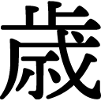](https://github.com/hakatashi/emoji/raw/master/images/toshi.png) | [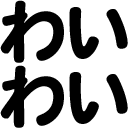](https://github.com/hakatashi/emoji/raw/master/images/waiwai.png) |  | [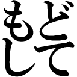](https://github.com/hakatashi/emoji/raw/master/images/modoshite.png)

`:i:` | `:suramu:` | `:na:` | `:masute:`
:-: | :-: | :-: | :-:
 |  |  | 

`:kakkoii:` | `:kakko-warai:` | `:wasshoi:` | `:zyousiki-desu:`
:-: | :-: | :-: | :-:
 |  |  | 

`:chian-ga-warui:` | `:chian-ga-nai:` | `:yarudake:`
:-: | :-: | :-:
 |  | 

`:0ri-aru:` | `:1ri-aru:` | `:2ri-aru:` | `:3ri-aru:`
:-: | :-: | :-: | :-:
 |  |  | 

`:100ri-aru:` | `:1okuri-aru:` | `:5000chouri-aru:`
:-: | :-: | :-:
 |  | 

`:contradiction:` | `:tautology:` | `:de:` | `:baka:`
:-: | :-: | :-: | :-:
 |  |  | 

`:wakannaindesu:` | `:esolang:`
:-: | :-:
 | 

`:ac:` | `:wj:` | `:re:` | `:ce:`
:-: | :-: | :-: | :-:
 |  |  | 

`:tle:` | `:mle:` | `:wa:`
:-: | :-: | :-:
 |  | 

`:aoriika:` | `:shirimetsuretsu:`
:-: | :-:
 | 

`:awajishima:` | `:biwako:` | `:sadogashima:` | `:void:`
:-: | :-: | :-: | :-:
 |  |  | 
