# emoji

Emoji created by hakatashi

## License

[Creative Commons Zero v1.0 Universal](LICENSE)

## Emojis

`:0ri-aru:` | `:100ri-aru:` | `:1okuri-aru:` | `:1ri-aru:`
:-: | :-: | :-: | :-:
 |  |  | 

`:2ri-aru:` | `:3ri-aru:` | `:5000chouri-aru:` | `:ac:`
:-: | :-: | :-: | :-:
 |  |  | 

`:aichikenkei:` | `:akan:` | `:aoriika:` | `:awajishima:`
:-: | :-: | :-: | :-:
[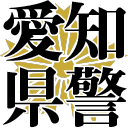](https://cdn.jsdelivr.net/gh/hakatashi/emoji@master/images/aichikenkei.png) |  |  | 

`:badend:` | `:baka:` | `:biwako:` | `:black:`
:-: | :-: | :-: | :-:
 |  |  | 

`:ce:` | `:chaunen:` | `:chian-ga-nai:` | `:chian-ga-warui:`
:-: | :-: | :-: | :-:
 |  |  | 

`:contradiction:` | `:damejan:` | `:de:` | `:doujiku-riba:`
:-: | :-: | :-: | :-:
 |  |  | [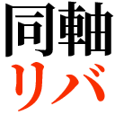](https://cdn.jsdelivr.net/gh/hakatashi/emoji@master/images/doujiku-riba.png)

`:doutan-kyohi:` | `:ee:` | `:esolang:` | `:genkai:`
:-: | :-: | :-: | :-:
 |  |  | [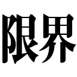](https://cdn.jsdelivr.net/gh/hakatashi/emoji@master/images/genkai.png)

`:gigantic-emotion:` | `:google-trying-to-mimic-microsoft:` | `:gouhou:` | `:guchol:`
:-: | :-: | :-: | :-:
[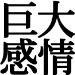](https://cdn.jsdelivr.net/gh/hakatashi/emoji@master/images/gigantic-emotion.png) |  |  | 

`:ha:` | `:haihai:` | `:hayakunero:` | `:hijimei:`
:-: | :-: | :-: | :-:
 | [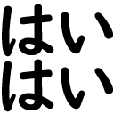](https://cdn.jsdelivr.net/gh/hakatashi/emoji@master/images/haihai.png) |  | 

`:ho-:` | `:ho:` | `:hoge:` | `:hototogisu:`
:-: | :-: | :-: | :-:
 | [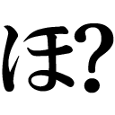](https://cdn.jsdelivr.net/gh/hakatashi/emoji@master/images/ho.png) |  | 

`:i:` | `:ihou:` | `:ikku:` | `:imai:`
:-: | :-: | :-: | :-:
 |  |  | [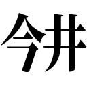](https://cdn.jsdelivr.net/gh/hakatashi/emoji@master/images/imai.png)

`:isshu:` | `:jaasorede:` | `:jimei:` | `:kachi:`
:-: | :-: | :-: | :-:
 | [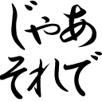](https://cdn.jsdelivr.net/gh/hakatashi/emoji@master/images/jaasorede.png) |  | 

`:kaishaku-chigai:` | `:kakko-warai:` | `:kakkoii:` | `:kami:`
:-: | :-: | :-: | :-:
 |  |  | 

`:kaokapu:` | `:korosuzo:` | `:kowa:` | `:kowai:`
:-: | :-: | :-: | :-:
[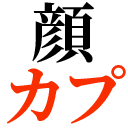](https://cdn.jsdelivr.net/gh/hakatashi/emoji@master/images/kaokapu.png) |  |  | 

`:kyoudai-kanjo:` | `:maa:` | `:masute:` | `:medetai:`
:-: | :-: | :-: | :-:
[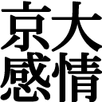](https://cdn.jsdelivr.net/gh/hakatashi/emoji@master/images/kyoudai-kanjo.png) |  |  | 

`:mho:` | `:mle:` | `:modoshite:` | `:moe:`
:-: | :-: | :-: | :-:
 |  |  | 

`:na:` | `:naguru:` | `:nandane:` | `:neko:`
:-: | :-: | :-: | :-:
 |  |  | [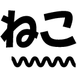](https://cdn.jsdelivr.net/gh/hakatashi/emoji@master/images/neko.png)

`:noushi:` | `:nya-n:` | `:otsu:` | `:re:`
:-: | :-: | :-: | :-:
 |  |  | 

`:rhyme:` | `:ryoukai:` | `:sadogashima:` | `:saikou:`
:-: | :-: | :-: | :-:
[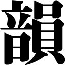](https://cdn.jsdelivr.net/gh/hakatashi/emoji@master/images/rhyme.png) |  |  | 

`:seyaroka:` | `:shoki-ka:` | `:shumi:` | `:sirangana:`
:-: | :-: | :-: | :-:
 |  |  | 

`:sirankedo:` | `:sonnani:` | `:sorasouyo:` | `:sorehasou:`
:-: | :-: | :-: | :-:
 |  |  | 

`:sorehauso:` | `:sou:` | `:soudane:` | `:sugoi-dekai:`
:-: | :-: | :-: | :-:
 | [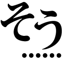](https://cdn.jsdelivr.net/gh/hakatashi/emoji@master/images/sou.png) | [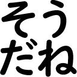](https://cdn.jsdelivr.net/gh/hakatashi/emoji@master/images/soudane.png) | 

`:sugoi:` | `:suramu:` | `:tautology:` | `:tazunekeri:`
:-: | :-: | :-: | :-:
[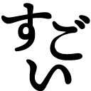](https://cdn.jsdelivr.net/gh/hakatashi/emoji@master/images/sugoi.png) |  |  | [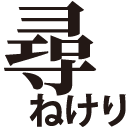](https://cdn.jsdelivr.net/gh/hakatashi/emoji@master/images/tazunekeri.png)

`:tle:` | `:toshi:` | `:tsuyomeno-genkaku:` | `:uso:`
:-: | :-: | :-: | :-:
 |  | [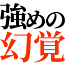](https://cdn.jsdelivr.net/gh/hakatashi/emoji@master/images/tsuyomeno-genkaku.png) | [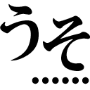](https://cdn.jsdelivr.net/gh/hakatashi/emoji@master/images/uso.png)

`:void:` | `:wa:` | `:waiwai:` | `:wakannaindesu:`
:-: | :-: | :-: | :-:
 |  |  | 

`:wakarazu:` | `:wasshoi:` | `:wj:` | `:ya:`
:-: | :-: | :-: | :-:
 |  |  | 

`:yakuza:` | `:yami:` | `:yarudake:` | `:yatta-:`
:-: | :-: | :-: | :-:
 |  |  | 

`:yurusan:` | `:yurushite:` | `:yusho:` | `:zentei-no:`
:-: | :-: | :-: | :-:
 | [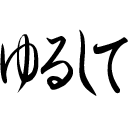](https://cdn.jsdelivr.net/gh/hakatashi/emoji@master/images/yurushite.png) |  | 

`:zyousiki-desu:`
:-:

